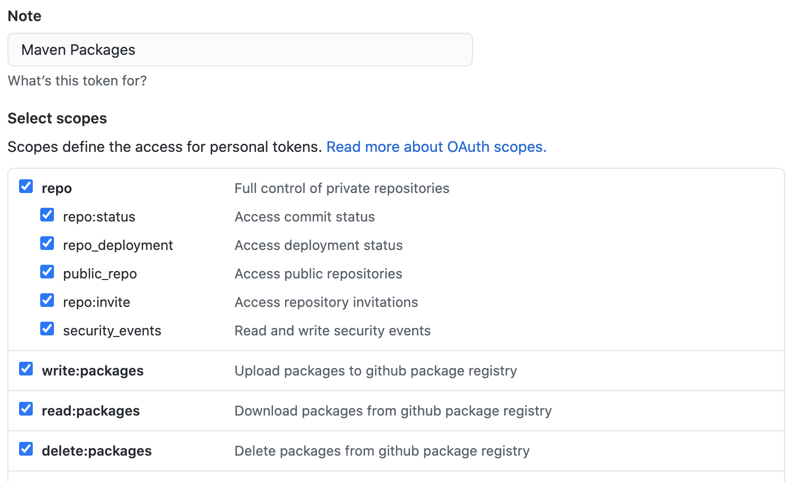

spring-boot-react-maven-starter
-----


This is a multi-module Spring Boot React Apache Maven starter app with good defaults. The react app is built using [create-react-app](https://github.com/facebookincubator/create-react-app).

This project provides a productive setup for building Spring Boot React applications. The application is divided into two Maven modules:

1. `api`: This contains Java code of the application.
2. `ui`: This contains all react JavaScript code of the application.

## Building the application with dependencies
The `api` module in this starter uses https://github.com/xebia-os/xebia-archunit-extension to enforce good application architecture practices by default. Check [ArchUnit](https://www.archunit.org/) website for reference. It is included as a maven dependency to the package published on Github Packages.

Github Packages needs valid Github credentials to pull the maven dependency. As a result, the build may fail by default. There are 2 options:

1. Add the correct Github credentials to local `$HOME/.m2/settings.xml` file. This is the recommended approach - it will involve some tweaking in the CI pipeline as well. The file may end up looking like below:

   ```
   <settings xmlns="http://maven.apache.org/SETTINGS/1.0.0"
             xmlns:xsi="http://www.w3.org/2001/XMLSchema-instance"
             xsi:schemaLocation="http://maven.apache.org/SETTINGS/1.0.0
                         http://maven.apache.org/xsd/settings-1.0.0.xsd">
       <servers>
           <server>
               <id>github</id>
               <username>REPLACE_WITH_GITHUB_USERNAME</username>
               <password>GITHUB_PERSONAL_ACCESS_TOKEN</password>
           </server>
       </servers>
   </settings>
   ```

   To generate a valid Github Personal Access Token please check:

   1. https://docs.github.com/en/github/authenticating-to-github/creating-a-personal-access-token

   2. You will need the `read:packages` scope for the token at minimum. Check out https://docs.github.com/en/packages/publishing-and-managing-packages/about-github-packages#about-scopes-and-permissions-for-package-registries. For local use, a common token can be generated with extra scopes for advanced use apart from simply pulling dependencies from  3rd party Github Packages. See screenshot for a sample.

      

   

2. Remove the `archunit-extension` dependency entirely from `pom.xml`. This is not recommended but can be done in case the architecture tests don't seem to add value.

We suggest taking the extra effort to keep the architecture tests enabled. This will enforce good application structure and coding practices.

## Running the full application

You can build the package as a single artifact by running the `./mvnw clean install`.
Next, you can run the application by executing:

```bash
$ java -jar api/target/api-0.1.0-SNAPSHOT.jar
```

The application will be accessible at `http://localhost:8080`.

## Features

This starter comes bundled with the following features:

1. Multi module Maven project: A multi module project to modularize backend and frontend code separately.
2. Maven wrapper: So, you don't need to install Maven on your machine.
3. Checkstyle: Enforce sane coding standard guidelines.
4. CORS enabled: A global configuration is added to enable CORS so that frontend can work seamlessly with backend during development.

## Running the backend for development mode

There are multiple ways to run the backend. For development, you can use your favorite IDE and run the
`com.xebia.starter.Application`. As soon as your code compiles, Spring Boot DevTools will reload the code.

You can also run the application using Maven.

```bash
$ cd api
$  ../mvnw spring-boot:run
```

## Running the frontend for development mode

**You will need Node 12+ and npm to run the dev server and build the project**.


```
$ cd ui
$ npm start
```

